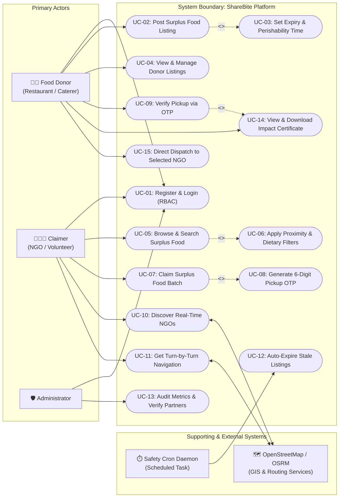

# QUESTION 2: USE CASE DIAGRAM & ACTOR ROLE SPECIFICATIONS
## Project: ShareBite (Surplus Food Recovery & Distribution Platform)

---

## 1. ACTOR IDENTIFICATION & ROLE SPECIFICATIONS

In the ShareBite ecosystem, actors are classified into **Primary Actors** (human users initiating interactions to achieve business goals) and **Secondary / Supporting Actors** (external services or automated agents invoked by the system).

| Actor Name | Type | Role & Responsibilities in ShareBite |
| :--- | :--- | :--- |
| **Food Donor** | Primary | Commercial food establishments (restaurants, bakeries, caterers, banquet halls). • Publishes surplus food batches with quantity, food type, and expiry time. • Tracks active, claimed, and historical donations. • Validates the 6-digit OTP presented by the volunteer upon collection. • Views and prints verified Impact Certificates. |
| **Claimer / NGO Volunteer** | Primary | Non-profit organizations, charities, food banks, shelters, and relief volunteers. • Explores surplus food and registered NGOs via interactive map and list views. • Applies proximity radius (2–50 km) and dietary filters (Veg/Non-Veg). • Claims/reserves surplus food batches and receives a secure 6-digit OTP. • Views turn-by-turn driving navigation to the donor location. |
| **System Administrator** | Primary | System auditors and platform overseers. • Monitors system-wide health and aggregated social impact metrics. • Reviews newly registered donors and NGOs, verifying their credentials with 1-click. |
| **OpenStreetMap & Routing Engine** | Supporting / External Service | External GIS provider (OSM Overpass, Nominatim, and OSRM). • Resolves latitude/longitude into human-readable physical addresses. • Provides real-time POI data for nearby NGOs and charities. • Calculates polyline driving geometries, transit distance, and ETA. |
| **HTML5 GPS Service** | Supporting / External Service | Client device hardware/browser location sensor. • Provides live high-accuracy geographic coordinates $(lat, lng)$ for user centering. |
| **Safety Cron Daemon** | Supporting / Automated Agent | Server-side scheduled worker (`node-cron`). • Executes automated sweeps every 60 seconds to invalidate expired food batches. |

---

## 2. UML USE CASE DIAGRAM

---

## 3. USE CASE RELATIONSHIP MATRIX

| Use Case ID | Use Case Name | Primary Actor | Associated Secondary Actors | Relationship Type |
| :--- | :--- | :--- | :--- | :--- |
| **UC-01** | Register & Login | Donor, Claimer, Admin | None | Base |
| **UC-02** | Post Surplus Food Listing | Food Donor | None | Base |
| **UC-03** | Set Expiry & Perishability Time | Food Donor | None | `<<include>>` in UC-02 |
| **UC-04** | View & Manage Listings | Food Donor | None | Base |
| **UC-05** | Browse & Search Surplus Food | Claimer / NGO | None | Base |
| **UC-06** | Apply Proximity & Dietary Filters | Claimer / NGO | None | `<<extend>>` to UC-05 |
| **UC-07** | Claim Surplus Food Batch | Claimer / NGO | None | Base |
| **UC-08** | Generate 6-Digit Pickup OTP | System | None | `<<include>>` in UC-07 |
| **UC-09** | Verify Pickup via OTP | Food Donor | None | Base |
| **UC-10** | Discover Real-Time NGOs | Claimer, Donor | OpenStreetMap Overpass | Base |
| **UC-11** | Get Turn-by-Turn Navigation | Claimer / NGO | OSRM Routing Service | Base |
| **UC-12** | Auto-Expire Stale Listings | Safety Cron Daemon | None | Base (Automated) |
| **UC-13** | Audit Metrics & Verify Partners | Administrator | None | Base |
| **UC-14** | Download Impact Certificate | Food Donor | None | `<<include>>` in UC-09 |
| **UC-15** | Direct Dispatch to Selected NGO | Food Donor | OpenStreetMap Overpass | Base |
