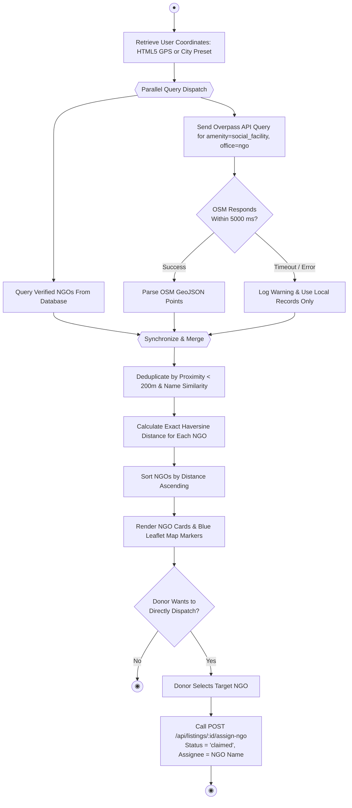

# QUESTION 4: ACTIVITY DIAGRAMS
## Project: ShareBite (Surplus Food Recovery & Distribution Platform)

---

## 1. OVERVIEW

Activity diagrams describe the dynamic behavior and control flows of the ShareBite system. They illustrate sequential and concurrent activities, decision points, and swimlane partitions across actors and system components.

Three primary activity diagrams are specified:
1. **Primary Workflow**: End-to-End Surplus Food Recovery & OTP Handover (Swimlane Diagram)
2. **Safety Daemon Workflow**: Automated Food Expiration Cron Sweeper
3. **Geospatial Workflow**: Real-Time NGO Discovery & Direct Dispatch

---

## 2. ACTIVITY DIAGRAM 1: END-TO-END SURPLUS FOOD RECOVERY & OTP PICKUP

This diagram illustrates the complete lifecycle from surplus food generation to successful distribution, utilizing swimlanes for **Food Donor**, **ShareBite System & Database**, and **NGO / Claimer Volunteer**.

```mermaid
flowchart TD
    %% Initial Node
    StartNode((●)) --> PostSurplus[Donor: Enter Food Details\n& Expiry Time]

    subgraph Donor_Partition ["Food Donor (Restaurant)"]
        PostSurplus
        AutoGPS[Click 'Use GPS' / Enter Address]
        SubmitListing[Submit Food Listing]
        WaitClaim[Wait for Volunteer Claim]
        ReceiveVolunteer[Volunteer Arrives at Venue]
        AskOTP[Ask Volunteer for 6-Digit OTP]
        InputOTP[Enter OTP in Verification Modal]
        ViewCert[View & Print Impact Certificate]
    end

    subgraph System_Partition ["ShareBite System & Database"]
        ValidateInputs{Valid Inputs &\nExpiry > Now?}
        SavePending[Persist Listing: Status = 'Pending']
        NotifyPublic[Publish to Discovery Map & Feeds]
        CheckAvail{Listing Still\nPending & Valid?}
        UpdateClaimed[Update Status = 'Claimed'\nRecord claimed_by & claimed_at]
        GenOTP[Generate Cryptographic 6-Digit OTP]
        SendOTP[Send OTP to Claimer Session]
        FetchRoute[Query OSRM for Route Polyline & ETA]
        VerifyOTP{Submitted OTP\nMatches Listing?}
        UpdatePickedUp[Update Status = 'Picked_Up'\nRecord picked_up_at = NOW()]
        IncrementMetrics[Increment Meals Saved & Kg Rescued]
        RejectOTP[Display 'Invalid OTP' Alert]
    end

    subgraph Claimer_Partition ["Claimer / NGO Volunteer"]
        BrowseMap[Browse Map & Apply Distance/Diet Filters]
        SelectBatch[Select Available Surplus Batch]
        ClickClaim[Click 'Claim Surplus Food']
        ReceiveOTPView[Receive 6-Digit OTP on Screen]
        GetDirections[Click 'Get Driving Directions']
        TravelToDonor[Transit to Donor Location]
        ShareOTP[Recite 6-Digit OTP to Donor]
        CollectFood[Collect Food Packages & Distribute]
    end

    %% Flow Connections
    PostSurplus --> AutoGPS --> SubmitListing --> ValidateInputs
    ValidateInputs -- "No" --> PostSurplus
    ValidateInputs -- "Yes" --> SavePending --> NotifyPublic --> WaitClaim

    NotifyPublic -.-> BrowseMap
    BrowseMap --> SelectBatch --> ClickClaim --> CheckAvail
    CheckAvail -- "No (Already Claimed/Expired)" --> BrowseMap
    CheckAvail -- "Yes" --> UpdateClaimed --> GenOTP
    
    GenOTP --> SendOTP --> ReceiveOTPView
    ReceiveOTPView --> GetDirections --> FetchRoute --> TravelToDonor
    
    TravelToDonor --> ReceiveVolunteer
    WaitClaim --> ReceiveVolunteer
    ReceiveVolunteer --> AskOTP --> ShareOTP --> InputOTP --> VerifyOTP

    VerifyOTP -- "No Match" --> RejectOTP --> InputOTP
    VerifyOTP -- "Match (Success)" --> UpdatePickedUp --> IncrementMetrics
    
    IncrementMetrics --> CollectFood
    IncrementMetrics --> ViewCert
    
    CollectFood --> EndSuccess((◉))
    ViewCert --> EndSuccess
```

---

## 3. ACTIVITY DIAGRAM 2: AUTOMATED FOOD SAFETY CRON SWEEPER

This activity diagram depicts the automated background daemon (`node-cron`) executing every 60 seconds to eliminate public health risks by retiring expired food listings.

```mermaid
flowchart TD
    CronStart((●)) --> TriggerCron[Timer Fires: Interval '* * * * *' (Every 60s)]
    
    TriggerCron --> QueryDB["Query DB: SELECT listings WHERE\nstatus IN ('pending', 'claimed')"]
    
    QueryDB --> CheckBatchFound{Any Listings\nFound?}
    CheckBatchFound -- "No" --> SleepDaemon[Idle Until Next Minute Interval]
    
    CheckBatchFound -- "Yes" --> LoopListings[Iterate Through Each Listing]
    
    LoopListings --> CompareTime{"Is expires_at < NOW() ?"}
    
    CompareTime -- "No (Still Fresh)" --> KeepActive[Maintain Current Status]
    CompareTime -- "Yes (Expired)" --> TransitionExpired["Update Status = 'expired'\nSet expired_at = NOW()"]
    
    TransitionExpired --> RemoveFeed[Remove From Public Discovery Feeds & Lock Claiming]
    
    KeepActive --> HasMore{More Listings\nin Batch?}
    RemoveFeed --> HasMore
    
    HasMore -- "Yes" --> LoopListings
    HasMore -- "No" --> SleepDaemon
    
    SleepDaemon --> CronEnd((◉))
```

---

## 4. ACTIVITY DIAGRAM 3: GEOSPATIAL NGO DISCOVERY & DIRECT ALLOCATION

This diagram illustrates how ShareBite integrates real-world OpenStreetMap Overpass data with internal database records to provide live NGO discovery and direct food allocation.



---

## 5. SUMMARY OF DIAGRAM ELEMENTS

- **Start / End States**: Denoted by `(●)` (Initial Node) and `(◉)` (Final Activity Node).
- **Swimlanes / Partitions**: Distinguish responsibilities across the **Food Donor**, **ShareBite System**, and **NGO Claimer**.
- **Decision Nodes**: Diamond shapes evaluate conditions such as `Valid Inputs?`, `OTP Match?`, `Time Expired?`, and `OSM Timeout?`.
- **Forks & Joins**: Represent parallel processes, such as concurrently querying the local database and OpenStreetMap Overpass servers.
